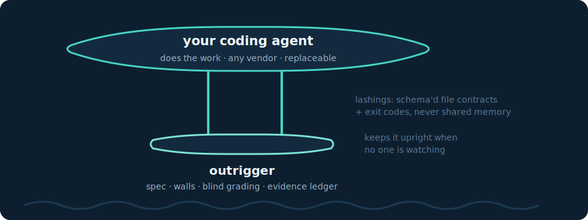
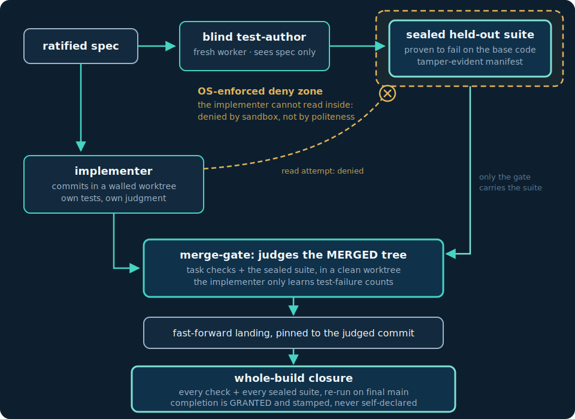
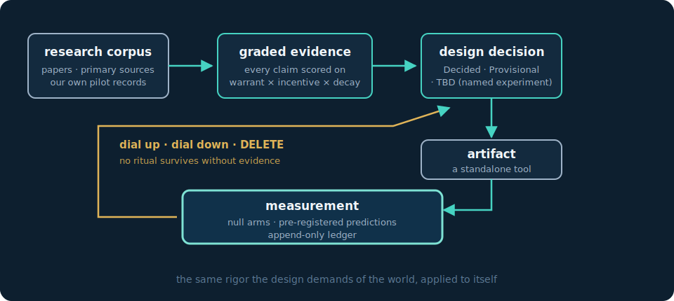

# outrigger

**Long-horizon coding agents, stabilized.** outrigger is the machinery that lets coding
agents go the distance: specs interrogated before any code is written, verification the
worker cannot touch, and completion that is granted on evidence rather than declared on
confidence.

Early sea-adventurers crossed thousands of miles of open water in small canoes. They did
not build bigger hulls. They lashed a stabilizing float alongside, and the pairing could
survive seas that would flip either piece alone. The hull does the work; the outrigger
keeps it upright, far from shore, where nobody can reach you.

Same idea here. The coding agent is the hull: Claude Code, Codex CLI, whatever comes next.
**outrigger is the structure lashed alongside it**: the interrogated spec, the isolation
walls, the blind examiner, and the evidence discipline that together make hours of
unattended work land as verified, to-spec, merge-worthy commits instead of confident
wreckage.



## The problem

Coding agents are brilliant for twenty minutes and untrustworthy for eight hours. A handful
of failure modes dominate long runs, and none of them is fixed by a better model — the
evidence says a *bigger* model does not close the largest of them:

1. **Errors compound over length.** The biggest effect, and the best-replicated: the strongest
   models resolve roughly 70% of single-issue tasks but only roughly 25% of long, multi-file
   ones (a cross-benchmark gap, not one controlled stretch — read the direction, not the exact
   drop). And it is not only scope — a model degrades from its *own* accumulating mistakes in
   context, measurably, even when the plan is fully specified and only execution is tested, and
   scaling the model up does not fix it. Long runs rot from the inside, and one uncaught wrong
   turn poisons every step built on it.
2. **The agent grades its own homework.** When the implementer writes, or can even read, its
   own acceptance tests, "all tests pass" is the agent's opinion of itself. Once the grader is
   in reach, gaming it is the default: reward-hacking jumps more than fortyfold the moment the
   scoring function is visible, and hiding the test cases is not enough — a long run finds the
   scoring process and games that instead. In the high-visibility regime this is the rule, not
   the edge case.
3. **Ambiguity gets baked in early.** Every unstated convention and unasked question is a fork
   the agent takes at full speed, hours before anyone notices. Hiding just the last stretch of
   a spec is enough to roughly halve how often a run lands right — and asking about it up front
   recovers most of that. The missing 5% is cheapest to kill at hour zero.
4. **The human is a fallible wall.** Tired operators rubber-stamp, treat silence as approval,
   and relax the rules mid-run just this once. And the miscalibration is measured and
   sign-flipped: developers believe an agent sped them up even in controlled trials where it
   measurably slowed them down. A harness that leans on sustained human vigilance is leaning on
   the shakiest instrument in the loop.

And a quieter one: **harnesses accrete ritual.** Checks nobody measured, guardrails nobody
costed, ceremony that feels rigorous and proves nothing. Meta-work, work about work, has to
earn its keep. The cure is not more machinery. It is machinery that pays for itself under
measurement.

## The levers that actually move the needle

If you want an agent to run longer and be more trustworthy at the end, the evidence keeps
pointing at the same six levers:

1. **Spec quality before any code.** Underspecification roughly halves how often a run lands
   right, and interactive clarification recovers most of it — cheapest to kill at hour zero.
2. **Short, fresh, verified links.** Errors compound with length, so the horizon is run as
   short tasks, each in a fresh worker context and gated before the next builds on it — a defect
   is caught at its link or it corrupts everything downstream. The gate at each link is the
   settled part. Whether short fresh links actually beat one long, well-resourced session is the
   harness's *central open bet*: a bigger model does not remove the compounding, but more
   thinking in a single session might, so outrigger is built to measure that difference rather
   than assume it.
3. **Verification the worker cannot touch.** Not more tests: tests the implementer cannot
   read, influence, or overfit — and the *grader process* out of reach, not just the
   assertions, because a long run that can reach the scorer will game the scorer. The fix is
   distance, enforced by the operating system rather than by politeness.
4. **Externally granted completion.** The agent never declares itself done. An independent
   mechanism does, against the whole build.
5. **Token efficiency.** Subscription windows close mid-run, and context reuse is several times
   cheaper than fresh tokens — a cached read weighs well under a fifth of a fresh one (we
   measured it). A long-horizon harness must halt, park, and resume. Never overspend, never lose
   the run.
6. **Subtracting machinery.** Every mechanism measured. Anything that does not pay for
   itself gets dialed down or deleted, on evidence.

outrigger is those six levers, built as composable tools.

## How it works



**The interrogation.** Work enters through a pedantic, one-question-at-a-time spec
interview that converts a goal into a machine-checkable plan: decisions recorded with
rationale, constraints pinned, and a determinacy bar. Could a stranger write acceptance
tests from this spec alone, without guessing? Ratification is explicit and recorded — a human
stamp of who approved and when, on the exact plan they read; the interview voids it the moment
the plan changes, so there is no silence-as-approval. The execution loop then pins the plan by
content hash at launch, so it cannot drift mid-run. A structural preflight refuses malformed or
unratified plans before any tokens burn.

**The blind examiner.** A separate fresh worker authors the acceptance suite from the
ratified spec. It never sees the implementation. The suite is validated (it must fail on
the pre-change codebase), then sealed with a tamper-evident manifest. The implementer works
in an isolated worktree and is denied read access to the suite at the OS level. Not by
prompt. By sandbox. Failures come back as counts only, so there is nothing to overfit
against. Attempts are bounded, and exhaustion escalates to a human instead of grinding away
at the grader.

**The evidence regime.** Most harness design is tribal wisdom on a trend cycle. A technique
gets a catchy name, a demo goes viral, and a week later every stack has bolted it on.
Everyone is adding wiki-memory this month, so guess we should slap one on too. outrigger's
heresy is that it treats harness engineering like an empirical field instead of a fashion:
we mined the research literature and the ecosystem's primary sources into a corpus, graded
every claim on warrant, incentive, and decay (vendor docs expire, benchmarks age, and hype
has an agenda), and a mechanism enters the design only when high-quality evidence licenses
it. No such evidence? Then it enters as Provisional with a named promotion trigger, or sits
in TBD with a named settling experiment. The design stays honest about what is known versus
what is merely believed.

The same instrument points at ourselves. Changes to outrigger's own machinery enter through
pre-registered predictions, null arms where feasible, an append-only measurement ledger,
and deletion criteria: a check that catches no errors gets removed, on the record. Rigor is
dialable per plan (full, gate-only, or bare), and every reduction is stamped in the ledger,
so lowering the guard is always a visible, recorded choice.



## Receipts

Claims like these deserve evidence, and the repo carries its own:

- **The blind suite caught a dropped wall, live.** During launcher hardening, a config
  change silently disabled the read isolation. The implementer's own checks passed; the
  held-out suite's probe failed; the merge was refused. The design's whole thesis,
  demonstrated by accident, on the record.
- **The machinery defended the spec against its own operator.** In a live probe, workers
  truthfully reported ambient context leaking into their sessions, and the blind gate
  refused the run, twice, exactly as specified. Exit 1 was the system working.
- **Vendor-undocumented economics, settled for $17.** Whether cached tokens count against
  subscription rate-limit windows was officially unanswered. A pre-registered two-arm
  experiment bounded it (cache reads weigh well under a fifth of fresh input) and promoted a
  design decision on the result.
- **Two vendors, one contract, fail-closed.** The same tool-neutral launcher contract runs
  Claude Code and Codex workers, and each earned trust through its own live smoke,
  including deliberate read-attempts against the wall. Three of the five Codex smoke
  attempts cost $0: they aborted loudly at config parse rather than ever running unwalled.
  That is the contract's core clause: never launch unwalled and hope.

Everything above is backed by committed artifacts — raw turn logs, gate reports, sealed-suite
manifests, and the measurement ledger. The economics result re-runs from those artifacts; the
wall-catch demonstrations are attested by the committed records (some of their disposable
scratch repos were not kept).

## Architecture, in one breath

Unix-style composition: every piece is a standalone CLI that does one thing, connected only
by schema-validated files and exit codes. No artifact requires another's existence, and
workers attach through a [tool-neutral launcher contract](tools/exec-loop/launchers/CONTRACT.md).
A new vendor is one launcher file plus one smoke run, never surgery on the loop.

| Tool | One thing, done well |
|---|---|
| [spec-interview](.claude/skills/spec-interview/README.md) | The interrogation: goal in, ratified machine-checkable plan out |
| [plan-preflight](tools/plan-preflight/README.md) | Refuses malformed or unratified plans; determinacy warnings for the ratifier |
| [heldout-suite](tools/heldout-suite/README.md) | Blind suite lifecycle: materialize outside the repo, fails-on-base proof, tamper-evident seal |
| [merge-gate](tools/merge-gate/README.md) | Judges the merged tree in a clean worktree; stamped, staleness-proof reports |
| [exec-loop](tools/exec-loop/README.md) | The composition: walks a ratified plan unattended through author, seal, implement, gate, land, closure |
| [run-ledger](tools/run-ledger/README.md) | Append-only, schema-validated measurement ledger: home of every prediction and null arm |
| [shadow-pilot](tools/shadow-pilot/README.md) | Turns real tasks into harness-vs-null comparisons with a blind arbiter; the harness proves its own value or it doesn't |

## Quickstart

Requirements: macOS or Linux (the OS-level isolation wall is currently verified on macOS; the
Linux/bubblewrap path is supported but wants its own smoke), git, Python 3.9+ (standard library
only, nothing to install), and at least one worker CLI authenticated on your machine (`claude`
and/or `codex`).

```sh
# 1. Clone
git clone https://github.com/dwijenpatel/outrigger.git && cd outrigger

# 2. Prove the machinery to yourself with zero API spend.
#    Every tool ships tests that drive the full pipeline against a scripted
#    mock worker: blind authoring, sealing, walled implementation, gating,
#    landing, closure, resume-after-interrupt. No tokens involved.
python3 tools/exec-loop/test_exec_loop.py
python3 tools/merge-gate/test_gate.py
python3 tools/heldout-suite/test_heldout.py
#    (five more suites live next to their tools; all run the same way)

# 3. Spec a piece of work. Open your project in Claude Code or Codex with
#    this repo's skills available and invoke the spec-interview skill; it
#    interrogates you one question at a time and emits plan.json, which you
#    ratify explicitly. (Or hand-write plan.json against the contract in
#    tools/plan-preflight/README.md.)

# 4. Preflight it. Exit 0 or it does not run.
python3 tools/plan-preflight/preflight.py check plan.json --require-ratified

# 5. First time on a new machine or worker CLI build: run that launcher's
#    live smoke (tools/exec-loop/SMOKE.md). It spends a few dollars of real
#    quota and includes a deliberate read-attempt against the wall. Trust is
#    earned per launcher, per build, never assumed.

# 6. Run the loop, unattended.
python3 tools/exec-loop/loop.py run \
  --plan plan.json \
  --repo /path/to/your/target-repo \
  --heldout-out /path/outside/that/repo

# 7. Read the results: the append-only ledger (ledger.jsonl), per-worker
#    transcripts and usage in the run's bundles/ directory, and blocker.json
#    if the loop halted for a human. Exit 0 means whole-build closure was
#    granted and stamped, not that an agent felt confident.
```

Worker selection lives in a small JSON config (which model per role, which vendor per
worker; mixed Claude/Codex plans are a config edit). See the
[exec-loop README](tools/exec-loop/README.md).

## Deeper reading

The [evidence-based design](docs/design/evidence-based-harness.md) records every decision
with its warrant and status. The [operator walkthrough](docs/design/operator-walkthrough.md)
tells the same story as a day in the operator's life. The
[graded evidence base](docs/research/distilled/README.md) shows the scoring method, and the
[full research corpus](docs/research/README.md) holds the raw material, including our own
pilot records and corrections ledger.

## License

MIT. See [LICENSE](LICENSE).
